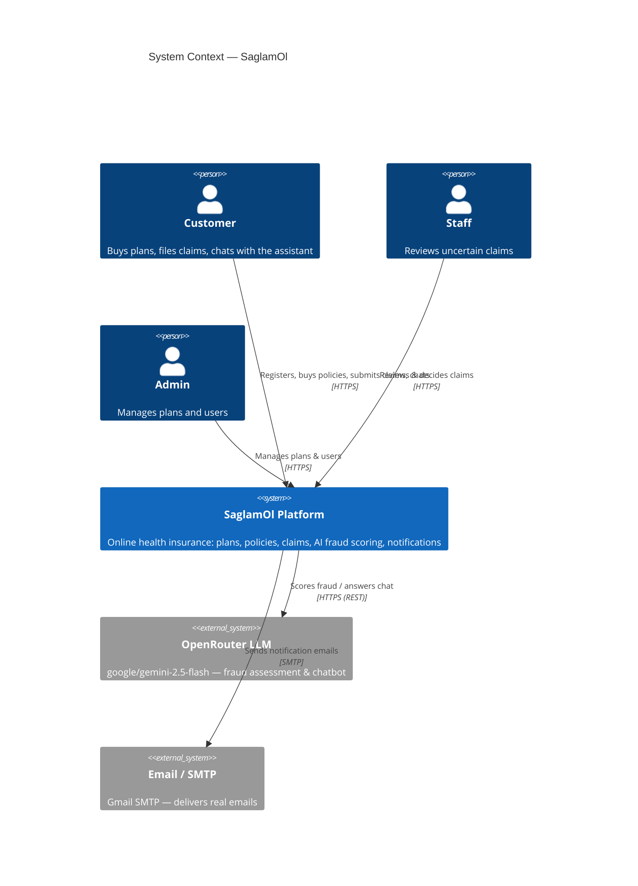
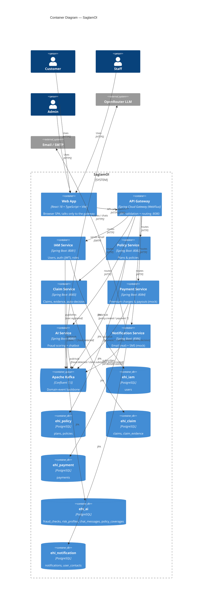
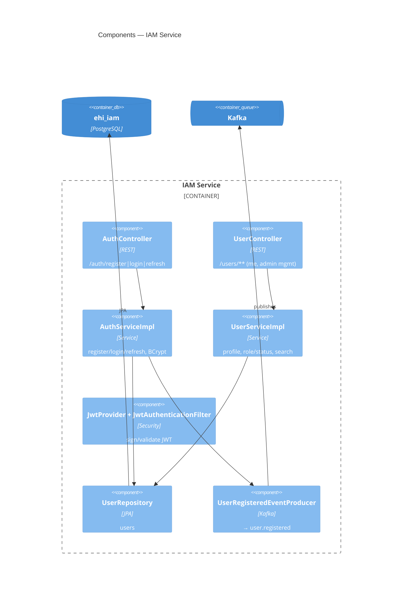
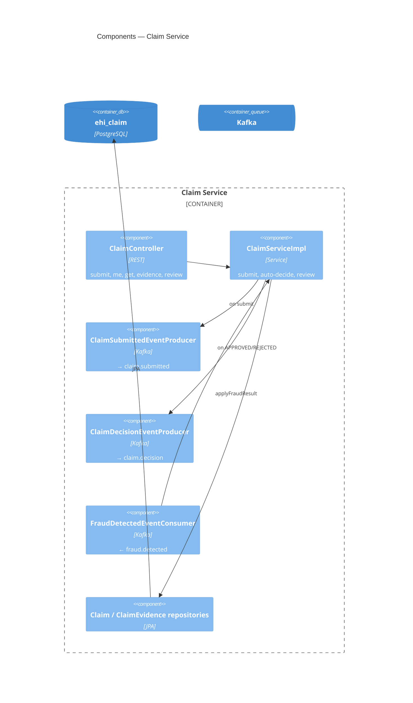
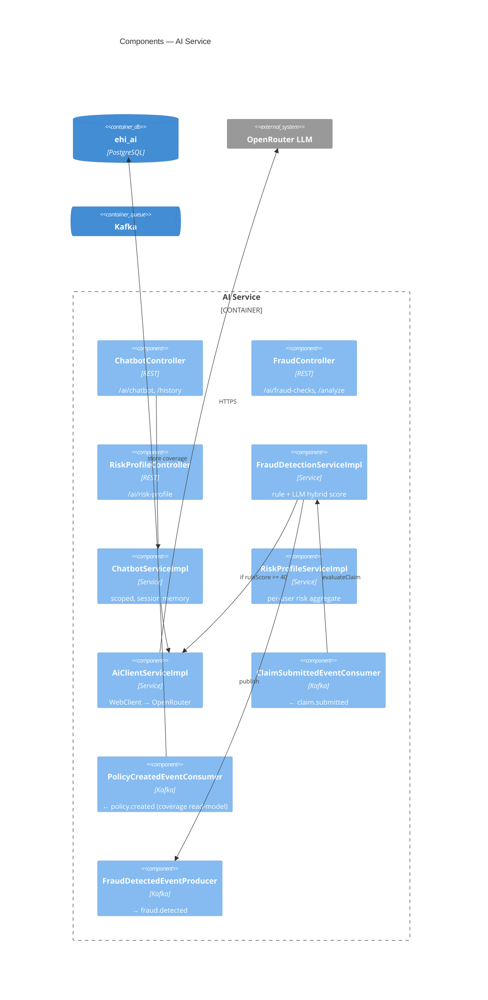

# SaglamOl — C4 Architecture Model

A complete C4 description of the SaglamOl e-health insurance platform across all four
levels: **Context → Container → Component → Code**. Mermaid `C4*` diagrams render on
GitHub and most Markdown viewers; tables are provided alongside for portability.

> **C4 in one line:** zoom from the system in its environment (L1), into its deployable
> building blocks (L2), into the parts inside each building block (L3), down to code (L4).

**Legend:** Person 🧑 · Software System ▢ · Container (app/store) ▭ · Component ◻ ·
synchronous call `──▶` · asynchronous event `⇢`

---

## Level 1 — System Context

**Scope:** SaglamOl is a B2C **single-insurer** platform — the platform *is* the insurer.
It serves three kinds of users and depends on two external systems.



### Actors
| Actor | Role | What they do |
|---|---|---|
| **Customer** | `CUSTOMER` | Register/login, browse & buy plans, submit claims + evidence, view policies/claims/payments/notifications, use the AI assistant |
| **Staff** | `STAFF` | Work the review queue of `UNDER_REVIEW` claims, inspect the AI fraud assessment, approve/reject, search members |
| **Admin** | `ADMIN` | Create/delete plans, view & search users, change roles, suspend users, view all policies/claims/payments |

### External systems
| System | Purpose | Protocol | Notes |
|---|---|---|---|
| **OpenRouter LLM** | Fraud assessment + chatbot replies | HTTPS REST (OpenAI-compatible) | Model `google/gemini-2.5-flash`; called only by the AI service |
| **Email / SMTP (Gmail)** | Real email delivery | SMTP | Called only by the Notification service; SMS is **mocked** (logged), not an external system |

---

## Level 2 — Container Diagram

Inside the SaglamOl system: a web client, an API gateway, six backend microservices (each
with its **own** PostgreSQL database), a Kafka broker as the event backbone, a shared
library, and supporting tooling.



### Containers

| Container | Tech | Port | Database | Responsibility |
|---|---|---|---|---|
| **Web App** | React 18, TypeScript, Vite | 5174 (dev) | — | SPA; auth, dashboards, all role UIs; talks only to the gateway |
| **API Gateway** | Spring Cloud Gateway (WebFlux) | 8080 | — | Single entry; validates JWT, routes `/api/v1/**`; public: auth + `GET /plans` |
| **IAM** | Spring Boot (Web, JPA, Security) | 8081 | `ehi_iam` | Users, JWT issuance, roles, user admin |
| **Policy** | Spring Boot | 8082 | `ehi_policy` | Plan catalog, policy lifecycle, payment saga |
| **Claim** | Spring Boot | 8083 | `ehi_claim` | Claims, evidence upload, AI auto-decision, staff review |
| **Payment** | Spring Boot | 8084 | `ehi_payment` | Premium charges & claim payouts (mock processor) |
| **AI** | Spring Boot + WebClient | 8085 | `ehi_ai` | Fraud scoring (rules + LLM), risk profiles, chatbot |
| **Notification** | Spring Boot + Mail | 8086 | `ehi_notification` | Email (real SMTP) + SMS (mock), event-driven |
| **Kafka** | Confluent 7.5 (+ Zookeeper) | 9092 | — | Asynchronous domain-event backbone |
| **infra** (library) | Plain Java jar (mavenLocal) | — | — | Shared contract: events, enums, topics, DTOs, exceptions |
| **Kafka UI** | provectuslabs/kafka-ui | 8090 | — | Inspect topics, messages, consumer-group lag |

### Two communication styles
- **Synchronous** — Browser → Gateway → service (HTTP/JSON, JWT-secured). Used for all
  user-initiated requests and reads.
- **Asynchronous** — services publish/consume **Kafka events**; never direct
  service-to-service HTTP. Used for all cross-service side effects (payment, activation,
  fraud scoring, notifications).

---

## Level 3 — Component Diagrams (inside each container)

Every Spring service follows the same layered package convention:
`controller/` → `service/` (+ `service/impl/`) → `repository/` → `entity/`, plus
`kafka/` (producers/consumers), `mapper/` (MapStruct), `config/`, `dto/`, and a
`security/` (JWT filter). Components below are the real classes.

### 3.1 IAM Service



| Component | Type | Responsibility |
|---|---|---|
| `AuthController` | Controller | `/api/v1/auth/{register,login,refresh}` |
| `UserController` | Controller | `/api/v1/users/**` — `me`, password, list/search, role, status |
| `AuthServiceImpl` | Service | Register (BCrypt), login, refresh; `@Transactional`; publishes `user.registered` |
| `UserServiceImpl` | Service | Profile read/update, change role/status, search (paginated) |
| `JwtProvider` / `JwtAuthenticationFilter` | Security | HS384 sign/validate; populates `SecurityContext` |
| `UserRepository` | Repository | `users` table access |
| `UserRegisteredEventProducer` | Kafka producer | Publishes `user.registered` (keyed by userId) |
| `User` | Entity | id, email, password(hash), firstName, lastName, phone, role, active, timestamps |

### 3.2 Policy Service

| Component | Type | Responsibility |
|---|---|---|
| `PlanController` | Controller | `GET /plans`, `GET /plans/{id}`, `POST /plans`, `DELETE /plans/{id}` |
| `PolicyController` | Controller | `POST /policies`, `/me`, `/{id}`, `PUT /{id}/cancel`, `GET /` |
| `PlanServiceImpl` | Service | Create/list/get plans; **delete guarded** (rejects if policies reference it) |
| `PolicyServiceImpl` | Service | Purchase (one-active-policy guard), activate, cancel; `@Transactional` |
| `PolicyCreatedEventProducer` | Kafka producer | `→ policy.created` (incl. coverageAmount) |
| `PaymentCompletedEventConsumer` | Kafka consumer | `← payment.completed` → activate policy |
| `PaymentFailedEventConsumer` | Kafka consumer | `← payment.failed` → cancel policy |
| `PlanRepository`, `PolicyRepository` | Repository | `plans`, `policies` |
| `Plan`, `Policy` | Entity | catalog item / purchased coverage (status lifecycle) |

### 3.3 Claim Service



| Component | Type | Responsibility |
|---|---|---|
| `ClaimController` | Controller | submit, `/me`, get, `POST /{id}/evidence` (multipart), list, `PUT /{id}/review` |
| `ClaimServiceImpl` | Service | `submitClaim`, `applyFraudResult` (auto-decision by score), `reviewClaim`; `@Transactional` |
| `ClaimSubmittedEventProducer` | Kafka producer | `→ claim.submitted` |
| `ClaimDecisionEventProducer` | Kafka producer | `→ claim.decision` (APPROVED/REJECTED) |
| `FraudDetectedEventConsumer` | Kafka consumer | `← fraud.detected` → applies the auto-decision |
| `Claim`, `ClaimEvidence` | Entity | claim + uploaded evidence metadata (files on a mounted volume) |

### 3.4 Payment Service

| Component | Type | Responsibility |
|---|---|---|
| `PaymentController` | Controller | `POST /process` (admin), `/me`, `/{id}`, `GET /` |
| `PaymentServiceImpl` | Service | `processPayment` — **idempotent** per `(referenceId, referenceType)`; `@Transactional` |
| `MockPaymentProcessor` | Service | Completes a PENDING payment (~2s) → `payment.completed` (invalid amount → `payment.failed`) |
| `PolicyCreatedEventConsumer` | Kafka consumer | `← policy.created` → charge premium |
| `ClaimDecisionEventConsumer` | Kafka consumer | `← claim.decision` (APPROVED) → payout |
| `PaymentCompletedEventProducer`, `PaymentFailedEventProducer` | Kafka producer | `→ payment.completed/failed` |
| `Payment` | Entity | userId, referenceId, referenceType, amount, status, transactionId |

### 3.5 AI Service



| Component | Type | Responsibility |
|---|---|---|
| `ChatbotController` / `FraudController` / `RiskProfileController` | Controller | chatbot + history; fraud check/analyze; risk profile |
| `FraudDetectionServiceImpl` | Service | Hybrid score: rule (coverage-based threshold) + LLM blend `0.4/0.6`; publishes `fraud.detected` |
| `ChatbotServiceImpl` | Service | Session-aware, topic-scoped chatbot |
| `RiskProfileServiceImpl` | Service | Aggregates per-user risk across claims |
| `AiClientServiceImpl` | Service | `WebClient` calls to OpenRouter |
| `ClaimSubmittedEventConsumer` | Kafka consumer | `← claim.submitted` → score |
| `PolicyCreatedEventConsumer` | Kafka consumer | `← policy.created` → upsert `policy_coverages` read-model |
| `FraudDetectedEventProducer` | Kafka producer | `→ fraud.detected` |
| `FraudCheck`, `RiskProfile`, `ChatMessage`, `PolicyCoverage` | Entity | scoring result, risk aggregate, chat history, coverage read-model |

### 3.6 Notification Service

| Component | Type | Responsibility |
|---|---|---|
| `NotificationController` | Controller | `GET /notifications/me`, `GET /notifications` (admin) |
| `NotificationServiceImpl` | Service | Persist + dispatch + `correlationId` dedup; collapses EMAIL+SMS in `/me` |
| `NotificationSender` → `ChannelNotificationSender` | Service | Dispatch by channel |
| `EmailProvider` → `SmtpEmailProvider` / `MockEmailProvider` | Service | Real SMTP (`!it`) / logging (`it`) |
| `SmsProvider` → `MockSmsProvider` | Service | Logs `SMS TO {phone} : {msg}` |
| `RetryScheduler` | Service | Re-attempts FAILED notifications |
| **7 consumers** | Kafka consumer | `user.registered`, `policy.created`, `payment.completed/failed`, `claim.submitted/decision`, `fraud.detected` |
| `Notification`, `UserContact` | Entity | notification record; userId→email/phone read-model |

### 3.7 API Gateway

| Component | Type | Responsibility |
|---|---|---|
| Route config (`application.yml`) | Config | Maps `/api/v1/**` path prefixes → service URIs |
| `JwtAuthenticationFilter` (global) | Filter | Validates JWT on protected routes; permits public paths |
| `SecurityConfig` | Config | WebFlux security; `public-paths` / `public-get-paths` |

> No database, no Kafka — pure routing + auth boundary.

### 3.8 infra (shared library)
`event/` (7 event records) · `enums/` (UserRole, PolicyStatus, ClaimStatus, ClaimType,
PaymentStatus, PaymentReferenceType, NotificationType, NotificationChannel) ·
`config/KafkaTopics` · `dto/` (ApiResponse, PagedResponse, ErrorResponse) ·
`exception/` (Base*, NotFound/Unauthorized/BadRequest/DuplicateResource, ServiceException).

---

## Level 4 — Code (representative)

C4 Level 4 (class-level) is usually generated on demand for one critical path. Example:
the **claim auto-decision** inside `ClaimServiceImpl.applyFraudResult(FraudDetectedEvent)`.

```
FraudDetectedEventConsumer.consume(event)
  └─▶ ClaimServiceImpl.applyFraudResult(event)        @Transactional
        ├─ claimRepository.findById(event.claimId())  → Claim
        ├─ guard: if claim.status != SUBMITTED → return            (idempotent)
        ├─ claim.setRiskScore / fraudFlags / aiExplanation
        ├─ decide by score:
        │     < 40 → APPROVED (approvedAmount = amount)
        │     40–69 → UNDER_REVIEW
        │     ≥ 70 → REJECTED (auto reason)
        ├─ claimRepository.save(claim)
        └─ if APPROVED || REJECTED:
              claimDecisionEventProducer.publish(ClaimDecisionEvent)  → claim.decision
```

Key types involved: `FraudDetectedEvent` (infra), `Claim` + `ClaimStatus` (infra enum),
`ClaimRepository`, `ClaimDecisionEventProducer`, `KafkaTemplate<String, ClaimDecisionEvent>`.

---

## Appendix A — Event catalog (the choreography)

| Topic | Produced by | Consumed by | Effect |
|---|---|---|---|
| `user.registered` | IAM | Notification | Welcome email/SMS; upsert UserContact |
| `policy.created` | Policy | Payment, Notification, AI | Charge premium · POLICY_PENDING · store coverage |
| `payment.completed` | Payment | Policy, Notification | Activate policy · POLICY_ACTIVATED / PAYMENT_SUCCESS |
| `payment.failed` | Payment | Policy, Notification | Cancel policy · PAYMENT_FAILED |
| `claim.submitted` | Claim | AI, Notification | Fraud scoring · CLAIM_SUBMITTED |
| `fraud.detected` | AI | Claim, Notification | Auto-decision · FRAUD_ALERT (if risky) |
| `claim.decision` | Claim | Payment, Notification | Payout (if APPROVED) · CLAIM_APPROVED/REJECTED |

All events: JSON-serialized, **keyed by domain id** (userId/policyId/claimId/paymentId)
for per-entity ordering; consumers are **idempotent**.

## Appendix B — Data stores (database-per-service)

| Database | Owner | Key tables |
|---|---|---|
| `ehi_iam` | IAM | `users` |
| `ehi_policy` | Policy | `plans`, `policies` |
| `ehi_claim` | Claim | `claims`, `claim_evidence` |
| `ehi_payment` | Payment | `payments` |
| `ehi_ai` | AI | `fraud_checks`, `risk_profiles`, `chat_messages`, `policy_coverages` |
| `ehi_notification` | Notification | `notifications`, `user_contacts` |

Schema is managed by **Liquibase** per service (`db.changelog-master.yaml`); JPA runs
`ddl-auto: validate`. No table is shared across services.

## Appendix C — Cross-cutting concerns

| Concern | How |
|---|---|
| **AuthN** | JWT (HS384), issued by IAM, validated at gateway + each service |
| **AuthZ** | `@PreAuthorize` role checks (CUSTOMER/STAFF/ADMIN) |
| **Consistency** | Eventual (via events); idempotent consumers + `@Transactional` save-then-publish |
| **Config/secrets** | Env vars via git-ignored `.env`; compose fails fast if `JWT_SECRET` unset |
| **Observability/tooling** | Swagger per service, Kafka UI (:8090), Postman collection |
| **Deployment** | Docker Compose; one network; one DB container hosting all six databases |
