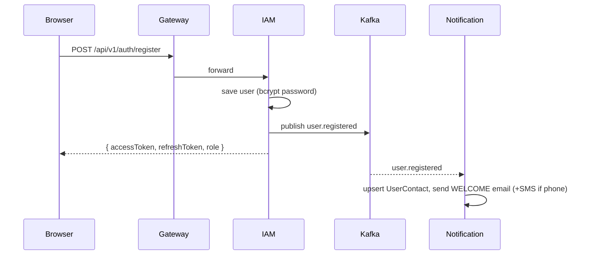
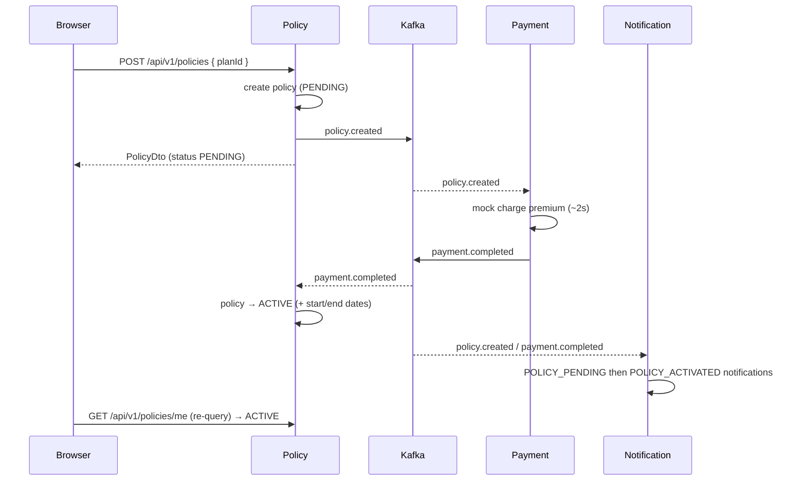
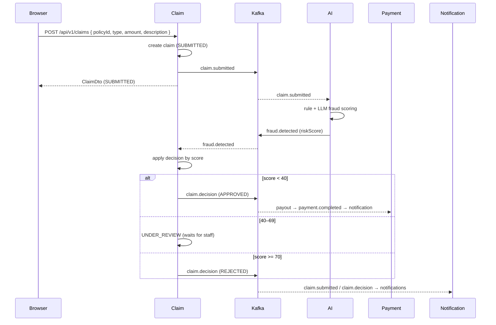
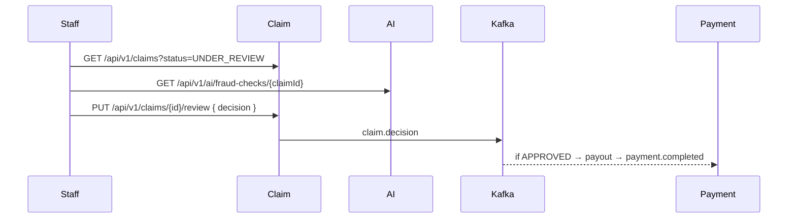
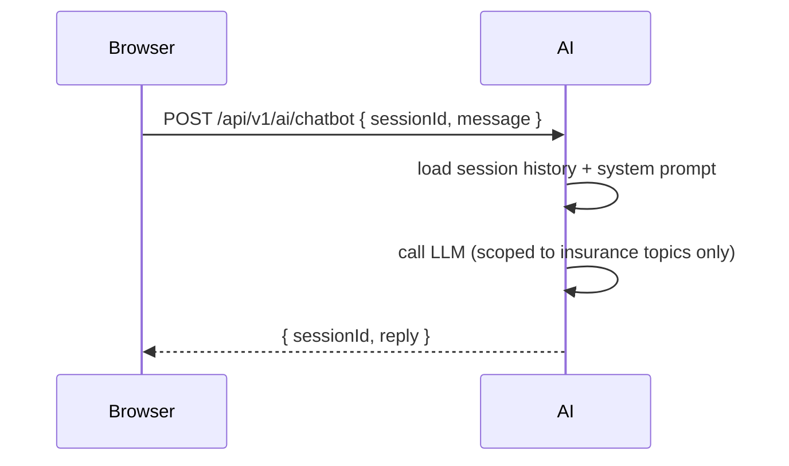

# E-Health Insurance — Project Flow

End-to-end flow of the platform, both as a **general overview** and as concrete **API-call /
event sequences**. The platform is a B2C single-insurer MVP: the platform *is* the insurer.

> See also: `APIS.md` (full endpoint reference) and `E-Health-Insurance.postman_collection.json`.

---

## 1. Architecture at a glance

```
                          ┌─────────────┐
   Browser (React) ─────▶ │  Gateway    │  :8080  (JWT validation + routing)
   :5174 (dev)            └──────┬──────┘
                                 │ /api/v1/**
        ┌────────────┬───────────┼───────────┬────────────┬──────────────┐
        ▼            ▼           ▼           ▼            ▼              ▼
     ┌──────┐   ┌────────┐  ┌───────┐   ┌─────────┐  ┌──────┐   ┌──────────────┐
     │ IAM  │   │ Policy │  │ Claim │   │ Payment │  │  AI  │   │ Notification │
     │ 8081 │   │  8082  │  │ 8083  │   │  8084   │  │ 8085 │   │     8086     │
     └──┬───┘   └───┬────┘  └───┬───┘   └────┬────┘  └──┬───┘   └──────┬───────┘
        │           │           │            │          │              │
        └───────────┴───────────┴─────┬──────┴──────────┴──────────────┘
                                       ▼
                              ┌─────────────────┐        each service has its own
                              │  Apache Kafka   │        PostgreSQL database
                              │ (event backbone)│        (ehi_iam, ehi_policy, …)
                              └─────────────────┘
```

- **Gateway** — single entry point; validates the JWT, routes `/api/v1/**` to the right service.
  Public routes: `POST /api/v1/auth/**`, `GET /api/v1/plans/**`.
- **6 services** — each owns its database (database-per-service) and exposes Swagger
  (`/swagger-ui.html` on its own port).
- **Kafka** — services communicate asynchronously via domain events (never direct service-to-service HTTP).
- **Roles** — `CUSTOMER`, `STAFF`, `ADMIN`.

---

## 2. General flow (user journeys)

### Customer journey
1. **Register / Log in** → receive JWT → a welcome email/SMS is sent in the background.
2. **Browse plans** (public) → **purchase a policy** → mock payment runs automatically → policy
   becomes **ACTIVE**.
3. **Submit a claim** → AI scores fraud risk instantly and auto-decides:
   - low risk → **APPROVED** → payout paid automatically;
   - medium risk → **UNDER_REVIEW** → waits for a staff decision;
   - high risk → **REJECTED**.
4. **Track** claims, policy, payments, and notifications. Ask the **AI assistant** insurance questions.

### Staff journey
- Review the **UNDER_REVIEW** queue, inspect AI fraud assessments, **approve/reject** claims.

### Admin journey
- Create **plans**, view all **users / policies / claims / payments / notifications**, manage user
  **roles** and **active status**.

---

## 3. Key principle: HTTP is synchronous, money & side-effects are asynchronous

Every state-changing HTTP call returns immediately; the consequences (payment, activation,
notifications) happen via Kafka events. The frontend re-queries to see the final state.

**Event topics:** `user.registered`, `policy.created`, `payment.completed`, `payment.failed`,
`claim.submitted`, `claim.decision`, `fraud.detected`.

---

## 4. Detailed flows (API calls + events)

### 4.1 Registration & login



- `POST /api/v1/auth/register` `{ email, password, firstName, lastName, phone? }` → tokens.
- `POST /api/v1/auth/login` `{ email, password }` → tokens.
- `POST /api/v1/auth/refresh` `{ refreshToken }` → new token pair.
- All later requests send `Authorization: Bearer <accessToken>`.

### 4.2 Buy a policy (the payment saga)



- Pre-check: browse plans via `GET /api/v1/plans` (public).
- `POST /api/v1/policies { planId }` — **rejected (400)** if the user already has an ACTIVE/PENDING policy.
- Response is `PENDING`; re-query `GET /api/v1/policies/me` after a few seconds → `ACTIVE`.
- On payment failure → `payment.failed` → policy is **CANCELLED** + a PAYMENT_FAILED notification.

### 4.3 Submit a claim (AI auto-decision)



- `POST /api/v1/claims` `{ policyId, claimType, amount, description }`.
- Optional: `POST /api/v1/claims/{id}/evidence` (multipart file).
- Thresholds: `<40` auto-APPROVED, `40–69` UNDER_REVIEW, `≥70` auto-REJECTED.
- Re-query `GET /api/v1/claims/me` to see the decision.

### 4.4 Staff manual review (UNDER_REVIEW claims)



- Only `UNDER_REVIEW` claims can be overridden. APPROVED triggers a `CLAIM_PAYOUT` payment.

### 4.5 AI assistant (chatbot)



- Pass `sessionId: null` to start a chat; reuse the returned `sessionId` to keep context.
- The assistant is scoped to e-health insurance topics and declines off-topic requests.
- `GET /api/v1/ai/chatbot/history?sessionId=...` returns the conversation.

### 4.6 Admin operations
- Plans: `GET /api/v1/plans`, `POST /api/v1/plans`.
- Oversight: `GET /api/v1/users` (+ `/search`, `/{id}`), `GET /api/v1/policies`,
  `GET /api/v1/claims`, `GET /api/v1/payments`, `GET /api/v1/notifications`.
- User management: `PATCH /api/v1/users/{id}/role`, `PATCH /api/v1/users/{id}/status`.

---

## 5. End-to-end happy path (one run)

| # | Actor | Call | Result |
|---|---|---|---|
| 1 | Customer | `POST /auth/register` | account + tokens; welcome notification |
| 2 | Customer | `GET /plans` | list of plans |
| 3 | Customer | `POST /policies {planId}` | policy `PENDING` |
| 4 | *(async)* | payment + activation | policy `ACTIVE` |
| 5 | Customer | `GET /policies/me` | sees `ACTIVE` policy |
| 6 | Customer | `POST /claims {...}` | claim `SUBMITTED` |
| 7 | *(async)* | AI scoring + decision | claim `APPROVED` / `UNDER_REVIEW` / `REJECTED` |
| 8 | Staff | `PUT /claims/{id}/review` | (only if `UNDER_REVIEW`) decision made |
| 9 | *(async)* | payout (if approved) | `PAYMENT_SUCCESS` notification |
| 10 | Customer | `GET /notifications/me` | full notification history |

---

## 6. Reliability notes (built in)
- **Idempotent consumers** — redelivered events don't double-charge or double-decide
  (payment dedup per reference; status guards on policy/claim; notification dedup per `correlationId`).
- **Transactional handlers** — state-changing service methods are `@Transactional`, so a failed
  publish rolls back the DB write and the event is cleanly re-processed on redelivery.
- **Message keys** — every event is keyed by its domain id (userId/policyId/claimId/paymentId),
  preserving per-entity ordering.
